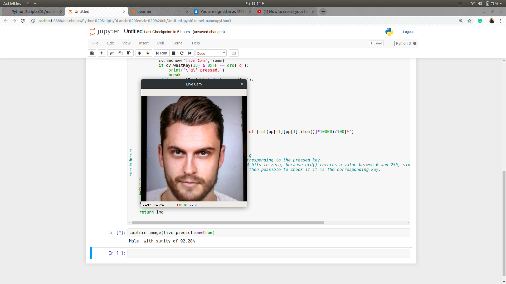
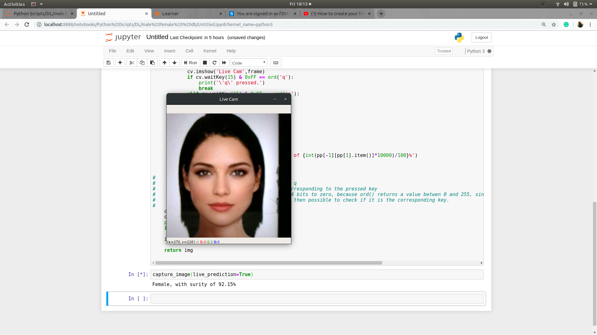

# Gender-classifier-on-facial-image
Predicts an individual is male or female on the basis of his/her facial features.

## Course of action for project 
The project aimed to develop a py app which uses camera to localize face and predict its features. As of now it is aimed at gender prediction.
The project will have three main tasks primarily:
1. Develop a GUI.
2. Working on algorithm to implement face localisation.
3. Improving present classifier model.

## Milestones achieved 
1. Model has reached >90% accuracy milestone.
2. Skeleton of the app has been developed. 

## Architecture
Transfer learning on resnet-32 pre-trained on Imagenet dataset.

## Data
700 Imges scrapped from "Google Images"

## Screenshots

